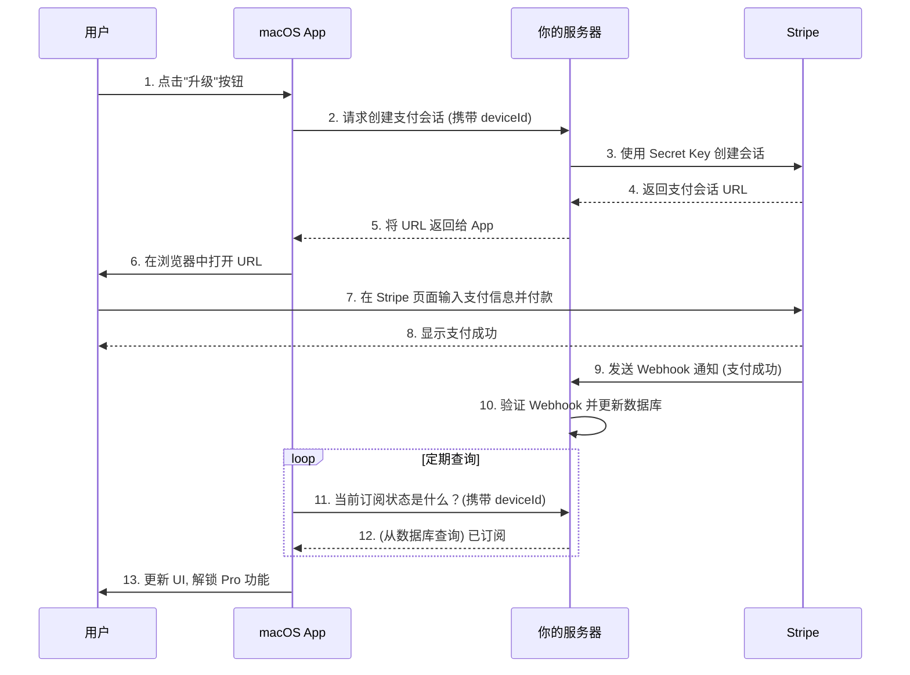

# HappyCursor - 技术设计与架构文档

**版本**: 1.0
**日期**: 2025-06-18
**作者**: AI 助手

## 1. 简介

本文档旨在明确 HappyCursor 订阅与支付功能所采用的技术栈、系统架构、API 接口设计和数据模型。其目的是为开发团队提供一份统一的"蓝图"，确保后续开发工作的一致性和高效性。

## 2. 技术栈总览

### 2.1. 客户端 (macOS App)
- **语言**: Swift
- **UI 框架**: AppKit / SwiftUI
- **核心职责**: 提供用户界面，管理用户交互，并向后端服务器发起网络请求。

### 2.2. 服务器端 (Server)
- **运行时环境**: Node.js
- **Web 框架**: Express.js
- **数据库**: MongoDB
- **ORM**: Prisma
- **支付服务 SDK**: `stripe-node`
- **环境变量管理**: `dotenv`
- **开发辅助**: `nodemon`

## 3. 系统架构

本系统采用经典的**客户端-服务器 (Client-Server)** 架构，支付流程通过 Stripe 提供的 **Web-based Checkout** 方案实现，以确保最高的安全性与合规性。

### 3.1. 核心流程

1.  **发起**: 客户端请求服务器创建支付会话。
2.  **重定向**: 服务器通过 Stripe API 获取一个安全的支付页面 URL，并返回给客户端。
3.  **支付**: 客户端使用系统浏览器打开该 URL，用户在 Stripe 托管的页面上完成支付。
4.  **通知**: Stripe 通过 **Webhook** 将支付结果异步通知给服务器。
5.  **验证**: 服务器验证 Webhook 通知的合法性，并将订阅状态更新至数据库。
6.  **同步**: 客户端通过轮询机制向服务器查询最新的订阅状态，并相应地更新 UI。

### 3.2. 流程图



## 4. 用户身份识别

系统采用**设备唯一标识符 (Device ID)** 作为用户身份识别方案。

- **生成**: 客户端在首次启动时，生成一个标准的 UUID 作为 `deviceId`。
- **存储**: `deviceId` 被安全地存储在客户端的 `UserDefaults` 或 Keychain 中。
- **通信**: 客户端在每次向服务器发起请求时，都必须在请求体或查询参数中携带此 `deviceId`。
- **局限性**: 此方案下，用户的 Pro 订阅资格与设备绑定，无法在多台设备间同步。

## 5. API 接口设计

### 5.1. 创建支付会话
- **路径**: `POST /api/checkout/create-session`
- **描述**: 为指定设备创建并返回一个 Stripe Checkout 会话 URL。
- **请求体**: 
  ```json
  {
    "deviceId": "ABC-123-DEF-456"
  }
  ```
- **成功响应 (200 OK)**:
  ```json
  {
    "checkoutUrl": "https://checkout.stripe.com/pay/cs_test_a1B2c3d4..."
  }
  ```

### 5.2. 获取订阅状态
- **路径**: `GET /api/subscriptions/status`
- **描述**: 查询指定设备的当前订阅状态。
- **请求参数**: `?deviceId=ABC-123-DEF-456`
- **成功响应 (200 OK)**:
  ```json
  {
    "isSubscribed": true,
    "plan": "pro_monthly",
    "currentPeriodEnd": "2025-07-20T10:00:00Z"
  }
  ```

### 5.3. 创建客户门户会话
- **路径**: `POST /api/subscriptions/manage-portal`
- **描述**: 为指定设备的用户创建一个用于管理其订阅的 Stripe 客户门户会话 URL。
- **请求体**: 
  ```json
  {
    "deviceId": "ABC-123-DEF-456"
  }
  ```
- **成功响应 (200 OK)**:
  ```json
  {
    "portalUrl": "https://billing.stripe.com/p/session/test_a1B2c3d4..."
  }
  ```

### 5.4. Stripe Webhook 接收器
- **路径**: `POST /api/webhooks/stripe`
- **描述**: 接收并处理来自 Stripe 的异步事件通知。**此接口必须进行严格的签名验证**。
- **关键处理事件**:
    - `checkout.session.completed`: 标志着新订阅的开始。服务器需在此事件中记录用户的 `stripeCustomerId`。
    - `invoice.payment_succeeded`: 标志着续费成功。
    - `invoice.payment_failed`: 标志着续费失败。
    - `customer.subscription.deleted`: 标志着订阅已取消。

## 6. 数据库模型 (Prisma Schema)

为了支持业务逻辑，我们定义一个核心的 `Subscription` 模型。

```prisma
// This is your Prisma schema file,
// learn more about it in the docs: https://pris.ly/d/prisma-schema

generator client {
  provider = "prisma-client-js"
}

datasource db {
  provider = "mongodb"
  url      = env("DATABASE_URL")
}

model Subscription {
  id    String @id @default(auto()) @map("_id") @db.ObjectId
  
  // 用户的设备 ID，确保其唯一性
  deviceId String @unique

  // Stripe 相关的 ID
  stripeCustomerId     String? @unique
  stripeSubscriptionId String? @unique

  // 订阅状态信息
  status           String?   // e.g., "active", "past_due", "canceled"
  currentPeriodEnd DateTime? // 订阅到期时间

  // 时间戳
  createdAt DateTime @default(now())
  updatedAt DateTime @updatedAt
}
``` 